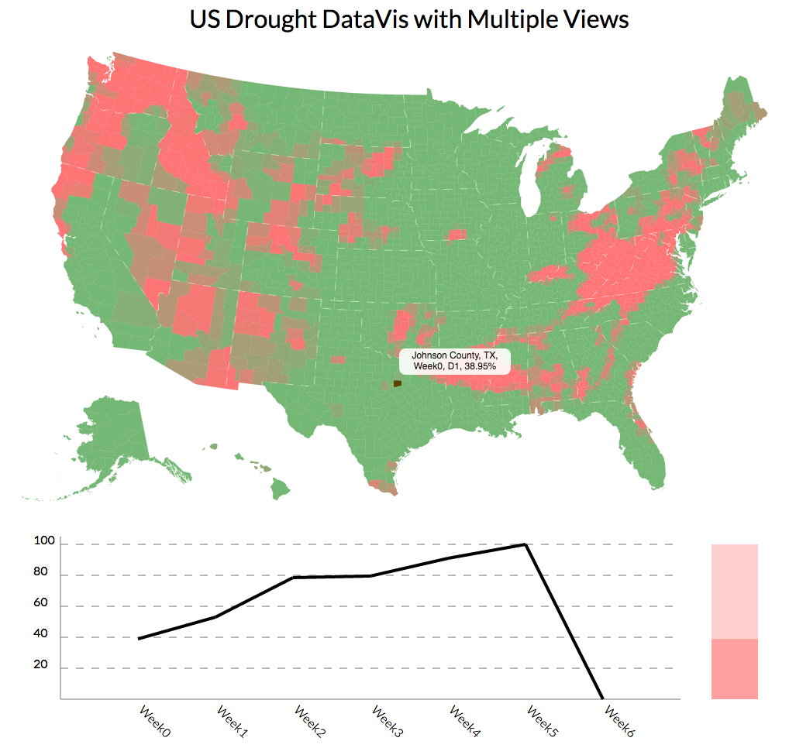

# US Drought DataVis

Project link: [https://zhangjingjun.github.io/USDroughtDataVis/](https://zhangjingjun.github.io/USDroughtDataVis/).

# Brief Description

I collected updated US drought data during past several weeks to create the third dimension, time, along with area and drought level, to create a more complex interacting design of visualizations. 

There are three visualizations in this design, a geomap that shows distribution of a specific data subset across every counties, a linechart that shows data trend of a given drought level in past several weeks, and a stacked bar that shows ratio of areas with different drought level inside a county in a given week.  

When user click a county in the map, all visualization will change accordingly to show relevant data with this county. Similarly user can click a line to change between weeks and click bar if they are interested in a different drought level data.

Whenever you move cursor to a element in the visualization, you will be able to get the detail of relevant data, so no buttons or words is needed in this design. 

# Technical Achievements

There are three dataset, drought data, map data and FIPS data. I introduced FIPS data to map state FIPS code in map data and state name in drought data. 

To synchronize loading of data before run any visualization code, I use d3 queue to load them and extract only relevant data into our predefined d3 hash maps. 

I also use d3 dispatch to create events that will enable interactions elegently between visualizations. There are two events are created in dispatch, load and state change event. Once data is ready, I trigger load event. For load event I add three callbacks to generate each visualization, and make sure user click will trigger state change event. For state change event, I add d3 transitions as content of function. So when user click any element, the state change will happen and all visualization will transition to a new state. I define a variable to store current state including county id, week id and level id so I can keep track of changes.

# Design Achievements

The processed data have three major dimension: county, week and drought level. The basic idea is to show each dimension of data in one visualization while the other two are fixed. For example, in the map, I am showing data distribution of a specific drought level across counties nationwide in a specific week. 

On the other hand, each element in three visualizations can be clicked to change one dimension and trigger the transition to new state of all three visualizations. This enables arbitrary data access in several clicks.

I eliminated buttons and minimized the words so that I can give users a clean visualization of data. However, it allow users to access detailed information on demand once they put cursor on any element they are interested in, by showing state, county, week and drought level data in a popup text box.
